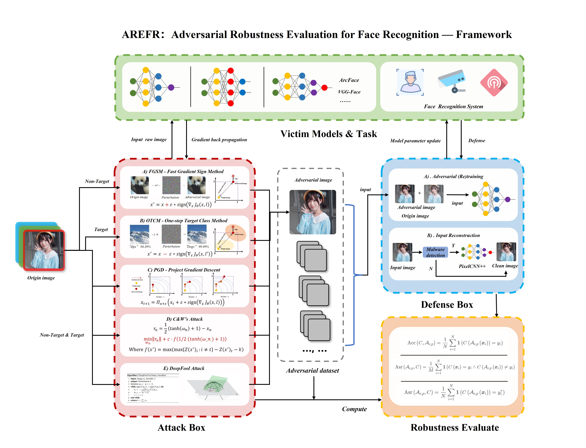
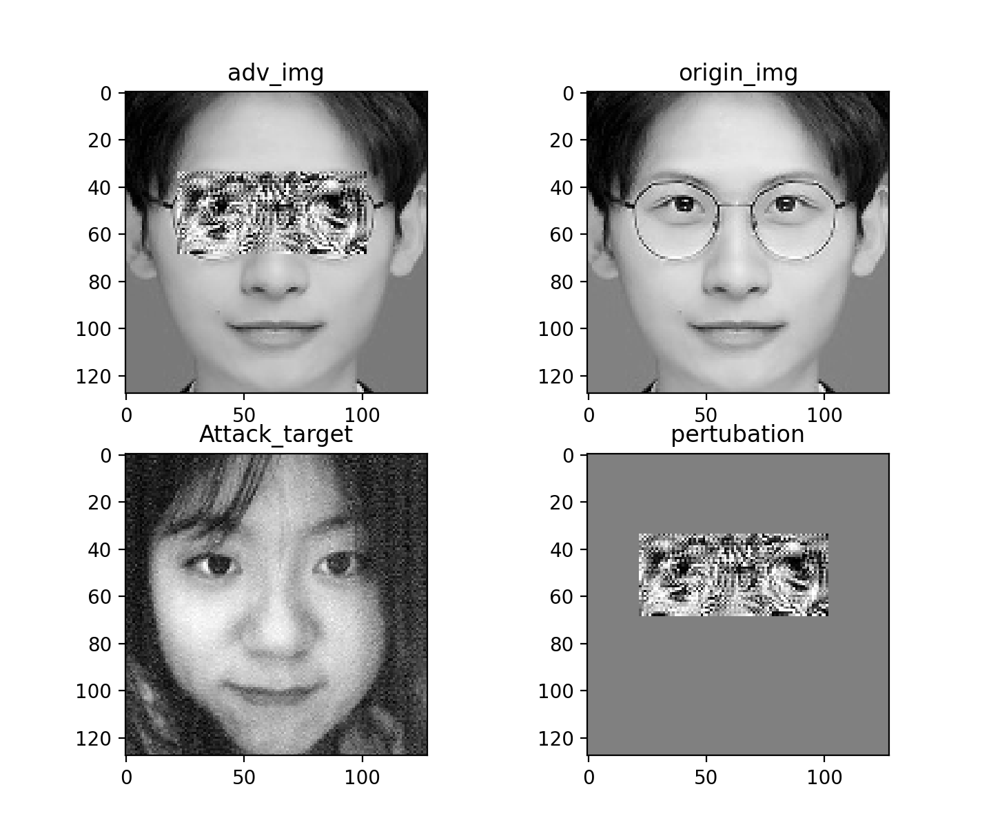
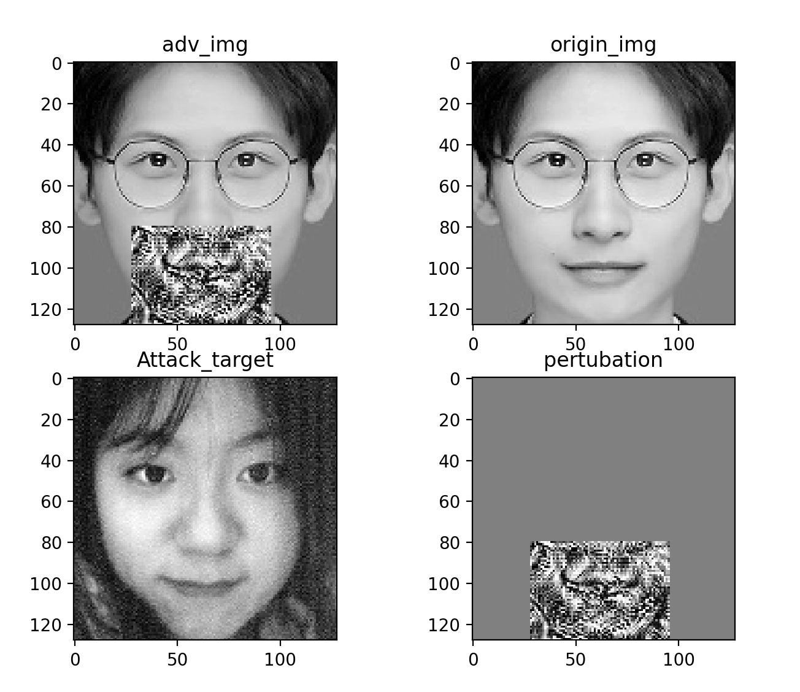

# 🐳 AREFR 使用手册



该文档为 人脸识别对抗鲁棒性评估平台(AREFR) 的中期报告暨解释性文档(中文版)，我们旨在向使用者说明该工程的所有功能，并且方便之后的扩展开发

>开发者:  西安电子科技大学人工智能学院 *Silvester_Ruan、LYC* 

---
## 🚀！ 2022.3.27 更新 


<center class="half">


</center>


- 实现了物理贴纸攻击(目前在数字环境下测试中有效)
  
  算法框架采用了PGD攻击的形式，在每次迭代时，只更新特定区域(眼镜区域和口罩区域)的扰动

- 你可以在 `./Attack/PhysicalAttack.py` 中设置区域以及攻击参数


## 零、安装AREFR及相关环境

0.1、克隆项目到本地：
```
git clone https://github.com/Heathcliff-saku/AREFR.git
```
0.2、新建conda虚拟环境 并激活：
```
conda create -n AREFR python=3.9
Linux:  source activate AREFR
Windows: activate AREFR
```
0.3、安装依赖库：
```
pip install -r requirements.txt
```
0.4、安装 pytorch -gpu 版本(注意您的电脑CUDA版本)

项目采用torch 1.10 CUDA 11.2版本

```
访问 https://pytorch.org/get-started/locally/ 安装合适的torch版本
```

## 一、工程文件结构
该项目主要关注人脸识别模型下的对抗鲁棒性测试， 并且着重关注物理场景下的模型鲁棒性。主要由人脸识别模型、攻击算法、评估代码、其他工具性的脚本组成，以下是工程文件内各个脚本的说明:

    · Attack                                 : 内含实现的攻击算法源代码
    · checkopints                            : 人脸识别backbone模型的训练权重
    · data                                   : 人脸识别模型的测试数据
        - facebank                           : 用于攻击时进行测试的基准数据集里面包含大型数据集中采集的人脸和现实生活中的人脸
        - lfw-align-128                      : LFW基准测试集, 用于训练后的模型精度评估
        - cleaned list.txt                   : LFW测试集的干净数据索引
        - lfw_test_pair_target_attack        : 用于有目标攻击测试的数据对
        - lfw_test_pair.txt                  : 用于无目标攻击测试的数据对

    · face_detect_feature                    : haar和lbp人脸检测的特征参数
    · fig                                    : 进化黑盒攻击的迭代过程图       
    · model                                  : 人脸识别模型部分
        - loss                               : 自定义focalloss
        - metric                             : ArcFace/CosFace 度量函数
        - mobilenet.py                       : backbone, mobilenet
        - resnet.py                          : backbone, resnet

    · sample                                 : 存放一些杂七杂八的图像, 比如眼镜口罩的图像, 以及一些测试图像
    · attack_evaluate.py                     : 攻击效果评估代码
    · attack_example.py                      : 生成单个对抗样本的代码
    · config.py                              : 工程的所有超参数设置
    · dataset.py                             : 训练数据的批量读取

    · demo.py                                : 人脸检测与识别系统的运行代码
    · face_alignment.py                      : 工具脚本 — 人脸对齐
    · feature_dict.pkl                       : facebank内所有人物的特征向量文件, 在运行demo时默认重新计算一遍

    · put_glass.py                           : 工具脚本 — 添加眼镜
    · put_mask.py                            : 工具脚本 — 添加口罩
    · shape_predictor_68_face_landmarks.dat  : 用于面部检测和人脸对齐的68点特征文件
    · take_picture.py                        : 工具脚本 — 向facebank内添加任务, 允许用户进行拍照和上传照片

    · test.py                                : 人脸识别模型训练后的测试代码
    · train.py                               : 人脸识别模型训练代码
    · utils.py                               : 一些工具函数


## 二、网络训练和测试
关于人脸识别网络搭建和训练测试流程，详细参考了 [Build-Your-Own-Face-Model](https://github.com/siriusdemon/Build-Your-Own-Face-Model)

### 2.1 受害模型
在人脸识别的受害模型上, 项目目前支持四种模型的训练:

    1、ArcFace + mobilenet
    2、ArcFace + resnet
    3、CosFace + mobilenet
    4、CosFace + resnet

在 *conf.py* 内可以修改

```python
""" 模型 超参数"""
backbone = 'fmobile'  # ['resnet', 'fmobile']
metric = 'arcface'  # ['cosface', 'arcface']
```
### 2.2 模型训练
在终端内输入 
```python
python train.py
```
即可使用默认超参数进行模型训练，若需要修改参数，我们提供两种方式，可以直接在*conf.py* 内修改，或者使用命令行，输入以下命令查看可修改的超参数及其说明：
```python
python train.py -h
```
目前支持的可修改的超参数为：

| 超参数名称 | 含义 | 可选值或数据类型 | 默认值|
| :---------: | :----: | :----: | :----: |
| --backbone | 设置主干网络采用的模型 | `'resnet'` `'fmobile'` |`'fmobile'`
| --metric | 网络训练时计算损失采用的距离度量函数 | `'cosface'` `'arcface'` |`'arcface'`
| --loss | 网络训练时的损失函数 | `'focal_loss'` `'cross_entropy'`|`'focal_loss'`
| --optimizer | 梯度下降使用的优化器 | `'sgd'` `'adam'` |`'sgd'`
| --batch_size | 一个批次的样本数量 | **int** |8
| --epoch | 训练轮数 | **int** | 60
| --lr | 梯度下降学习率 | **float** | 0.1


例如：
```python
python train.py --backbone='fmobile' --epoch=2 --lr=0.001 
```
### 2.3 模型测试
目前只支持LFW基准测试，我们将在未来引入更多的测试基准
> LFW(无约束自然场景人脸识别数据集)，该数据集由13000多张全世界知名人士互联网自然场景不同朝向、表情和光照环境人脸图片组成，共有5000多人，其中有1680人有2张或2张以上人脸图片。每张人脸图片都有其唯一的姓名ID和序号加以区分。

在LFW随机选取测试对6000对，进行模型测试，请运行
```python
python test.py
```

## 三、如何运行AREFR人脸识别系统

### 3.1 构建自己的面部特征库 

训练完成后的人脸识别模型可以将不同的用户面部输出为 余弦距离值较大的特征向量，为了实现本地的人脸识别，需要首先构建好面部特征库

为此，我们提供了照片采集的脚本`take_picture.py`

假设现在需要采集某个用户的面部图像，首先，在`conf.py`内修改`name`参数为该用户的姓名标识（如'rsw'）

有两种方法进行人脸采集

- 使用摄像头(默认)：定义完`name`后，运行以下命令，按下t进行拍摄捕获人脸
```python
python take_picture.py
```
- 传入照片(修改`conf.py`内的`use_cam`)：将`face_img`改为图像的地址，并运行
```python
python take_picture.py
```
之后，捕获并裁剪后的面部图像将存入 `./data/facebank/name` 中


### 3.2 运行人脸识别系统 

在完成图像采集后，运行 `demo.py` 文件，若facebank存在新的用户，请修改 `conf.py` 内的 `update_feature_dict = True` 。此时运行demo程序将首先更新facebank内用户的特征库信息。接下来便可看见人脸识别系统的图形化界面。

> PS：算法默认采取每帧图像并实时计算，这将消耗大量的计算能力。若用户的CPU性能较弱，可以修改 `conf.py` 内的 `is_realtime = False` 。此时系统将不开启实时计算，通过按键 `t` 捕获一帧图像进行检测

## 四、数字环境下的人脸识别系统攻防
### 4.1 生成单张人脸对抗样本
目前提供5种针对白盒模型的攻击算法：
- *[Goodfellow et al.]*:  FGSM (Fast Gradient Sign Method)
- *[Kurakin et al.]* : BIM (Basic Iterative Method)
- *[Dong et al.]*: MIM (Momentum Iterative Method)
- *[Madry et al.]*: PGD (Projected Gradient Descent)
- *[Carlini et al.]*: C&W (Carlini & Wagner Attack)

以及主要针对黑盒模型的攻击算法：
- *[Dong et al.]*: Evolutionary Attack

`attack_example.py` 提供了生成单张面部对抗样本的案例

1、指定采用某种攻击算法:
```python
attack_method = FacePGD(victim_model)
```
六种算法对应的类名称为：`FaceFGSM` `FaceBIM`  `FaceMIFGSM` `FacePGD` `FaceCW` `Evolutionary` 

2、生成单张对抗样本：
```python
digtal_single_test(input_x_root, target_x_root, attack_method, victim_model)
```

3、您也可以直接修改 `attack_example.py` 的以下部分并运行：
```python
if mode == 'digtal':
        """
        digtal attack flow
        you first need Specify attack method
        """
        attack_method = FacePGD(victim_model)
        # attack_method = FaceCW(victim_model)
        # attack_method = FaceFGSM(victim_model)
        # attack_method = FaceBIM(victim_model)
        # attack_method = FaceMIFGSM(victim_model)
        # attack_method = Evolutionary(victim_model)

        """ then give the root of input and attack target """
        input_x_root = './data/facebank/rsw/1.jpg'  # true: rsw
        target_x_root = './data/facebank/Yao_Ming/Yao_Ming_0001.jpg'  # target: zqy
        digtal_single_test(input_x_root, target_x_root, attack_method, victim_model)
```

### 4.2 人脸识别模型鲁棒性评估：
批量生成对抗样本，并针对模型的鲁棒性进行评估。
采用LFW数据集中的6000个不同面部样本对进行模仿攻击：
运行 `attack_evaluate.py` 

指定攻击算法部分与4.1描述一致