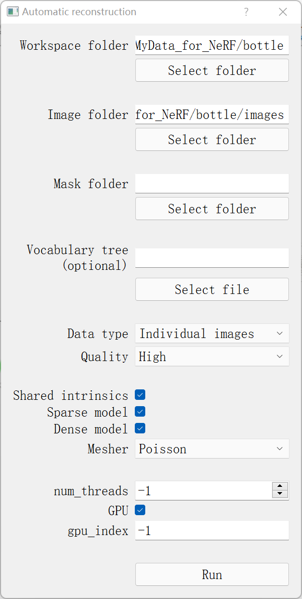
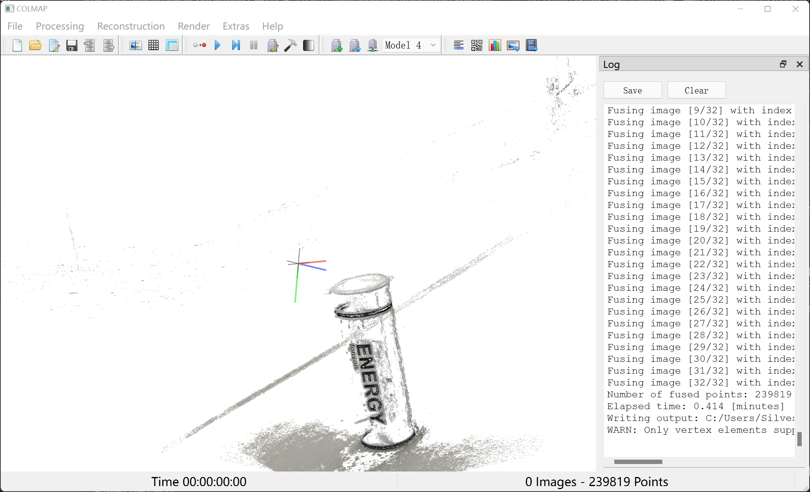

# NeRF 调研笔记


## ✔️ NeRF: Representing Scenes as Neural Radiance Fields for View Synthesis 
    📝 paper：  https://arxiv.org/abs/2003.08934
    🖥️ project：https://github.com/yenchenlin/nerf-pytorch.git

## ✔️ Mip-NeRF: A Multiscale Representation for Anti-Aliasing Neural Radiance Fields 
    借鉴了传统计算机图形学解决抗锯齿问题的预滤波方案，
    将使用圆锥体对像素采样，扩展NeRF能够在连续尺度下表示场景，
    并具有抗锯齿，细节突出的优势。
    📝 paper：  https://arxiv.org/abs/2103.13415
    🖥️ project：https://github.com/google/mipnerf


## ✔️ (INGP by Nvidia): Instant Neural Graphics Primitives with a Multiresolution Hash Encoding
    提出多分辨率哈希编码技术，NeRF是其一个应用的场景，
    使得模型训练时间降低到秒级。
    📝 paper：  https://arxiv.org/abs/2201.05989
    🖥️ project：https://github.com/NVlabs/instant-ngp

## ✔️ NeRF++: Analyzing and Improving Neural Radiance Fields
    📝 paper：  https://arxiv.org/abs/2010.07492
    🖥️ project：https://github.com/Kai-46/nerfplusplus

## ✔️ Urban NeRF：Urban Radiance Fields
    📝 paper：  https://arxiv.org/abs/2111.14643
    🖥️ project：   


## 数据集

- **Blender**: 
[nerf_synthetic.zip]([nerf_llff_data.zip](https://drive.google.com/file/d/16VnMcF1KJYxN9QId6TClMsZRahHNMW5g/view?usp=sharing))
  

- **LLFF**: 
[nerf_llff_data.zip](https://drive.google.com/file/d/16VnMcF1KJYxN9QId6TClMsZRahHNMW5g/view?usp=sharing)

## 数据集结构 
### LLFF
    -- dataset
       -- fern
       
          -- images
             (raw images)
                ...
          -- sparse
              (相机参数)
          -- poses_bounds.npy

       -- flower
        ...
       -- trex


---
## NeRF 实现
### 🖥️ 工程文件：https://github.com/yenchenlin/nerf-pytorch.git

1、下载数据集(LLFF数据集以及Blender数据集)：

2、下载数据集及相应的权重文件(来自作者的drive)后，命令行渲染：
```
python run_nerf.py --config configs/{DATASET}.txt --render_only
```
3、使用命令行进行训练：
```
python run_nerf.py --config configs/{DATASET}.txt 
```
----
4、如何制作数据集: 

**方法一**
    
>NeRF需要传入图像及其相对应的角度、距离信息，即`poses_bounds.npy`文件，需要使用到如下工程文件生成：

colmap：https://github.com/colmap/colmap

LLFF：https://github.com/Fyusion/LLFF

>可以通过colab进行依赖环境的安装，并执行*colmap*的*imgs2poses.py*脚本，将图像数据提前传入drive/xxx/images，并执行生产数据集的命令：

colmap_colab.ipynb:
 https://gist.github.com/kwea123/f0e8f38ff2aa94495dbfe7ae9219f75c

这个是修改后的，解决了cmake的版本兼容问题，可以成功运行*imgs2poses.py*：
https://colab.research.google.com/drive/1FoZ9RmxpE-ltIASCmpHg0WdETPoDmtex?usp=sharing#scrollTo=_-Xbgj71ctQf

>实际使用发现，脚本运行可能会存在一些问题，这和图像拍摄有关（拍摄图像在横向平移幅度较大,图片与图片之间的重复区域overlap太少导致），可以通过日志中出现的：

```
=> No good initial image pair found.
```
>判断图像拍摄是否不标准

---
**方法二**

此外，还可以使用colmap的用户界面进行相关文件的生成，并且可以直接对物体进行三维点云的重建

colmsp GUI下载： https://github.com/colmap/colmap/releases

使用方法：
  
  - 进入GUI后，`Reconstruction` --> `Automatic reconstruction`，选择工作文件夹和图像存放的文件夹，勾选 `Shared intrinsics` 和 `Sparse model` ，开始运行
  
    

  - 运行完成后，打开 `fused.ply` 可以查看场景的稠密点云（实际上也是完成了三维重建的任务，但我们需要使用NeRF达到更好的效果）

      

5、训练自己的数据集

工程文件：https://github.com/kwea123/nerf_pl

colab链接：https://colab.research.google.com/gist/kwea123/a3c541a325e895ef79ecbc0d2e6d7221/nerf_colab.ipynb#scrollTo=d35_YDDErL6T